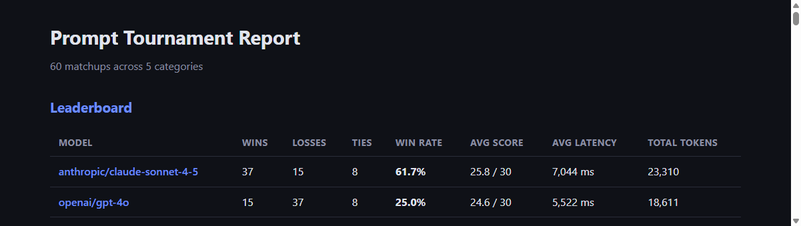
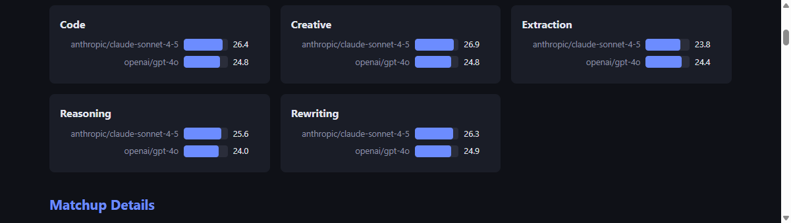
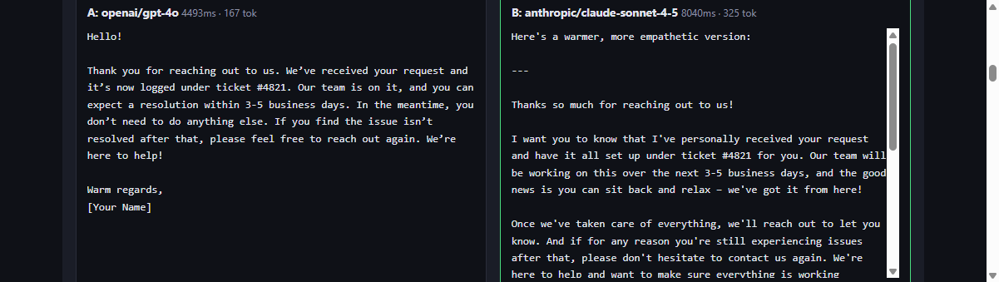
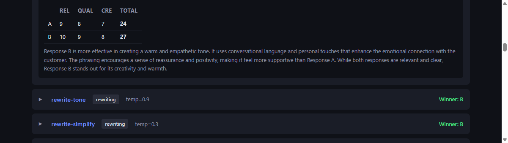
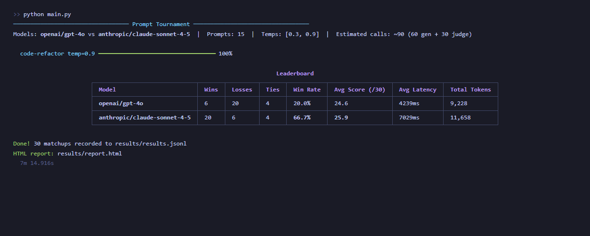

# Prompt Tournament

A CLI tool that throws the same prompts at two different LLM providers through the Concentrate API, uses a third LLM call to judge who did it better, and spits out a dark-themed HTML report with a leaderboard. I ran GPT-4o against Claude Sonnet 4.5 across 15 prompts, 2 temperature settings, and ~90 API calls per run.

## Setup

```bash
pip install -r requirements.txt
cp .env.example .env
# put your Concentrate API key in .env
```

## Running it

```bash
python main.py                                              # full tournament
python main.py --limit 3                                    # quick test, first 3 prompts only
python main.py --stream                                     # streaming demo, prints tokens live
python main.py --report-only                                # regenerate HTML from existing results
python main.py --models openai/gpt-4o-mini anthropic/claude-haiku-4-5   # swap models
```

## Project layout

| File | What it does |
|---|---|
| `main.py` | CLI entry point, runs the tournament loop, prints leaderboard |
| `api.py` | Concentrate API client - handles `/v1/responses`, retries, streaming |
| `prompts.py` | 15 prompts across 5 categories (rewriting, extraction, creative, reasoning, code) |
| `judge.py` | LLM-as-judge using structured JSON output |
| `report.py` | Builds a standalone `report.html` with all the results |

---

## Writeup

### What I built

The basic idea was: if Concentrate lets me hit different providers through one API, why not actually compare them? So I made a "prompt tournament" - 15 prompts across 5 categories, sent to both GPT-4o and Claude Sonnet 4.5, at two temperature settings each (0.3 and 0.9). That's 60 generation calls per run. Then each pair of responses gets judged by GPT-4o-mini using structured output (JSON schema mode), which scores both on relevance, quality, and creativity on a 1–10 scale. Another 30 calls for the judge. So roughly 90 API calls per run, and I ran it a couple times while tuning prompts and temps.

Everything gets logged to a JSONL file and rendered into a self-contained HTML report. The report has a leaderboard table, per-category bar charts, and expandable matchup cards where you can see both outputs side by side with the judge's scoring and reasoning.

I also built a `--stream` mode that prints tokens live from both models as a quick way to sanity-check that streaming works.

### What worked

The biggest win was honestly just the provider-switching experience. Changing from OpenAI to Anthropic was literally swapping a string from `openai/gpt-4o` to `anthropic/claude-sonnet-4-5`. No different SDK, no different auth setup, no reformatting the request body. My `api.py` client is like 200 lines and it handles both providers identically. That's the whole point of Concentrate and it does deliver on that.

Structured output worked great for the judge. I defined a JSON schema with score objects, a winner field, and reasoning - and it came back as valid parseable JSON every single time. That's what made the whole automated judging pipeline possible without having to do ugly regex parsing on free-text responses.

Streaming was smooth too. The SSE events (`response.output_text.delta` for chunks, `response.completed` at the end with usage data) were consistent and I didn't run into any dropped connections or weird edge cases.

Results-wise, Claude Sonnet 4.5 won pretty convincingly - 61.7% win rate over 60 matchups, scoring 25.8/30 on average vs GPT-4o's 24.6/30. Claude was stronger in creative and rewriting tasks especially. But GPT-4o was faster (5.5s avg vs 7s) and used fewer tokens, so there's a real latency-vs-quality tradeoff depending on the use case.

### What didn't / what was tricky

Getting the actual text out of the response was more annoying than it needed to be. You have to dig through `response.output[0].content[0].text` with type checks at every level (`type == "message"`, then `type == "output_text"`). I ended up writing a helper function `_extract_text()` just for this. A top-level convenience field would go a long way.

I also accidentally ran the tournament twice and the results got appended because I opened the JSONL file in append mode. That's my own fault, but it meant my report showed 60 matchups instead of 30. Not an API issue, just me being careless with file handling.

Temperature didn't seem to make a huge difference in the judge scores for most prompts, at least not as much as I expected. The 0.3 vs 0.9 split was more noticeable in creative tasks but for extraction and reasoning it barely moved the needle. Might need a wider range or different prompt types to really see it.

---

## API Friction and Doc Suggestions

Here's the stuff I ran into while building this. None of it was a blocker, but it slowed me down or made me guess when I shouldn't have had to.

**Response text is buried too deep.** The actual output text lives at `output[].content[].text` behind two layers of type checks. I get that the response format is designed to be flexible, but practically everyone's first question is "where's the text?" - a top-level `text` field or at least a prominent code snippet in the docs showing how to extract it would help a lot.

**The `input` field silently accepts both a string and a message array.** I figured this out by accident. It would be nice if the docs explicitly showed both forms - plain string for quick single-turn stuff, and the `[{role, content}]` format for conversations with a system prompt. I wasn't sure which was "correct" until I tried both.

**No clear reference for SSE event types.** I had to piece together the streaming event names (`response.output_text.delta`, `response.completed`) from experimentation. A single table in the docs listing every possible event type with its payload structure would save a bunch of time.

**Structured output schema placement isn't obvious.** You pass it as `body.text.format = {"type": "json_schema", "name": ..., "schema": ...}`. I had to try a few variations before landing on the right nesting. A complete request/response example for structured output mode in the docs - not just the schema definition, but the whole thing - would be really useful.

**Error response format isn't documented (or I couldn't find it).** Errors come back as `{"error": {"message": "..."}}` but I had to discover that by triggering errors on purpose. Documenting the error envelope and what HTTP status codes map to what (especially 429 rate limits with retry-after headers if they exist) would be helpful.

**Model list / naming convention.** The `provider/model-name` format is clean, but I didn't find a page listing which exact model strings are supported. Had to guess `anthropic/claude-sonnet-4-5` based on Anthropic's own naming. A simple table of available models would save the guesswork.

**Suggestion: add a Python/JS quickstart.** The docs are curl-heavy (at least when I was using them). A 10-line Python snippet showing "make a request, get the text back" would lower the barrier to entry a lot. That's what most people want in the first 5 minutes.

---

## Screenshots

### Leaderboard (HTML report)
60 matchups, Claude Sonnet 4.5 vs GPT-4o. Claude took 61.7% of wins.



### Category breakdown
Per-category average scores out of 30. Claude led in most categories; GPT-4o was close in extraction.



### Matchup detail - side by side outputs
Each matchup expands to show the prompt, both outputs with latency/tokens, and the judge's score + reasoning.



### Judge verdict
Scoring breakdown (relevance, quality, creativity) and the judge's reasoning for picking a winner.



### CLI output
The full run - 15 prompts x 2 temps, ~7 minutes, with a Rich-rendered leaderboard at the end.


